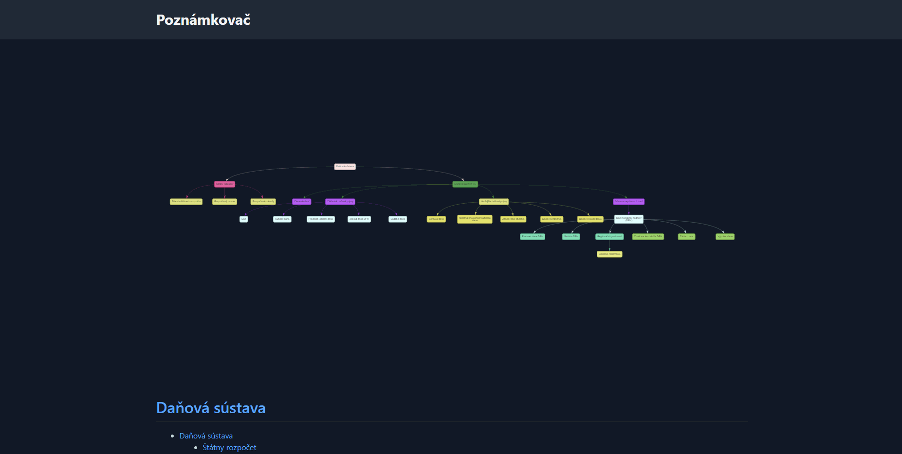

# Poznámkovač

Poznámkovač je aplikácia pre študentov, ktorá bola vytvorená študentom. S blížiacimi sa maturitnými skúškami som potreboval zefektívniť štúdium a organizáciu poznámok, a preto som vytvoril túto aplikáciu. Poznámky sú upravené z materiálov poskytnutých učiteľmi, knihami a rôznymi zdrojmi z internetu. Určite sa budem snažiť o to, aby boli všetci zúčastnení uvedení, no ak som niekoho vynechal alebo chcete určitý obsah odstrániť, prosím Vás, [kontaktujte ma](https://svit.ac).

Všetky súbory Markdown poznámok sú na GitHube a statické HTML je generované automaticky.

## Funkcie

Poznámkovač je čo najautomatizovanejší a obsahuje rôzne funkcie:

- Všetky poznámky sa píšu v [Markdown (`.md`) formáte](https://daringfireball.net/projects/markdown/);
  - Poznámkovač používa [Pythonov Markdown modul](https://python-markdown.github.io/);
  - [BB kód](https://bbcode.readthedocs.io/en/latest/tags.html) je taktiež podporovaný;
- Z nadpisov sa automaticky vytvorí a usporiada pojmová mapa (viď. obrázok vyššie);
  - Prejdením myšou (alebo kliknutím, ak máte zariadenie s dotykovou obrazovkou) sa zobrazí poznámka priliehajúca tejto bunke, a zvýraznia sa bunky ktoré s tým súvisia;
  - Kliknutím (alebo pre mobilné zariadenia dvojitým kliknutím) na bunku v pojmovej mape sa prenesiete priamo na miesto tejto poznámky;
- Zdrojový kód je komentovaný a licensovaný pod [GNU General Public License v3.0](https://choosealicense.com/licenses/gpl-3.0/);

## Technológie

Poznámkovač využíva nasledujúce technológie:

- Python (3.10+) - pozri `requirements.txt`;
- JavaScript;
- HTML a CSS (Tailwind);
- Vis.js (pre vizualizáciu pojmových máp);
- Tippy.js (pre zobrazenie tooltipov);
- Popper.js (pre správne umiestnenie tooltipov);

## Proces

1. Extrahovať definície a obsah z markdownu;
2. Vygenerovať Jinja šablónu nového obsahu markdown;
    - Taktiež vytvoriť JSON pre pojmovú mapu a vložiť ho do Jinja kontextu;
3. Vygenerovať HTML z markdownu;
4. Vygenerovať BBCode;

## Budúce funkcie

- [ ] Viac poznámok;
- [ ] Návod ako písať poznámky;
- [ ] Zoznam všetkých poznámok a predmetov;
- [ ] Drobné navigačné prvky;
- [ ] Optimalizácia SEO;
- [ ] Lepšie ovládanie tlače (či chceme tlačiť aj obsah, pojmovú mapu, atď...);

Som otvorený pre návrhy na nové funkcie (prostredníctvom issues).

## Inštalácia a spustenie

1. Klonujte repozitár z GitHubu;
2. Vytvorte virtuálne prostredie a nainštalujte požadované balíčky pomocou `pip install -r requirements.txt`;
3. Vygenerujte `site` priečinok (`python -m poznamkovac`);

## Ako prispieť

Ak máte záujem prispieť k vývoju Poznámkovača, neváhajte vytvoriť pull request s Vašimi zmenami/poznámkami alebo navrhnúť nové funkcie prostredníctvom issues.

Môžete taktiež tento projekt [sponzorovať](https://github.com/sponsors/SKevo18).

## Licencia

Táto aplikácia je poskytovaná pod licenciou MIT. Viac informácií nájdete v súbore `LICENSE`.
